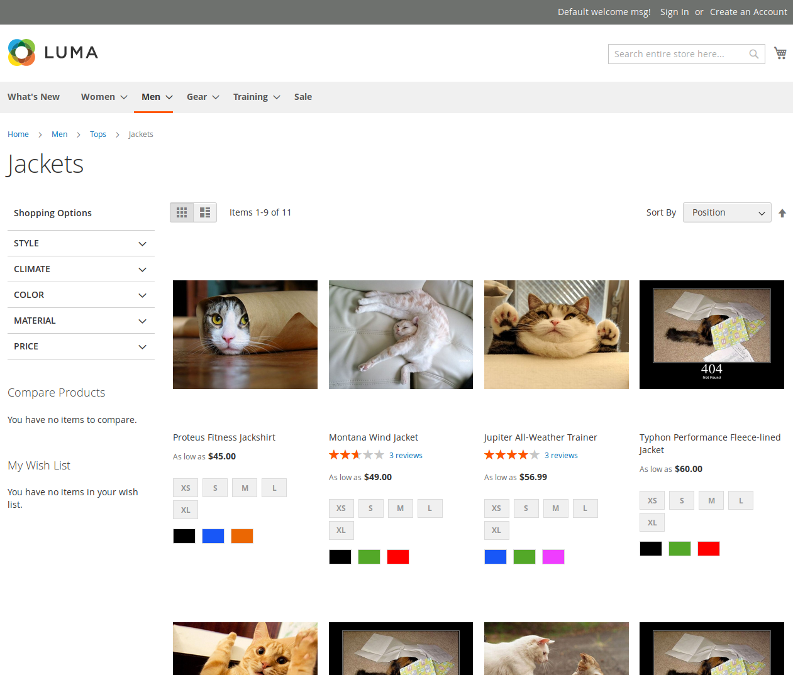

Orba Recruitment Magento 2 Backend Task
=======================================

Overview
--------

The purpose of this repository is to check skills of candidates applying to Orba for a position of Magento 2 Backend Developer.
If you are here, you probably want to work with us :-).

In the repository you will find an almost empty Magento 2 module called Orba_RandomCat.
Your task will be to fill in this module with code to achieve the following feature:

Change all product photos in catalog listing (and only there) to random cat photos using **Random Cat API**.

### Random Cat API

It's a simple JSON API with only one endpoint: http://randomcatapi.orbalab.com/

It is protected by API key. To be authorized you must pass `api_key` GET parameter to the endpoint. The key that you may use is `5up3rc0nf1d3n714llp455w0rdf0rc47s`.

As a response for request to this API you will get simple JSON object with just one attribute called "url", eg. `{"url": "http://supercats.com/randomkitty123.jpg"}`.

The API is heavily loaded, so from time to time (approximately 25% of all requests) it will not respond with HTTP status 200.

Collection of cats photos used by the API is a little bit outdated, so from time to time (approximately 30% of successfull requests) it will return URL pointing to a 404 page.

### Mockup

Recruitment task description
----------------------------

1. Clone this repository to your local Magento 2.4.x installation.
2. Build Orba_RandomCat module.
3. When you're done, create a Pull Request with your changes.

Assumptions and watchouts
-------------------------

1. Frontend should always show correct image. In case of any problems with API, internal `view/frontend/web/images/404.jpg` photo must be shown.
2. Don't worry about cache. It's OK that images are random only on the first page load.
3. Log all failed API responses and invalid images to a text log file.
4. Treat API credentials as non-public. 
5. Write unit tests to get more points.
6. Make your code SOLID to get even more points.